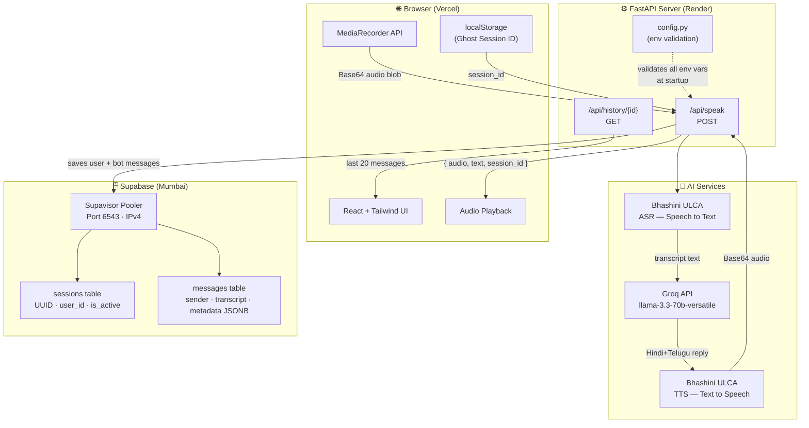

# 🎙️ VoiceBot — Multilingual AI Voice Assistant

> A real-time, interactive voice bot that understands and responds in a natural **Hindi + Telugu** code-mixed conversation. Speak — and hear an AI-powered voice response in seconds.

[](https://fastapi.tiangolo.com/)
[](https://vitejs.dev/)
[](https://console.groq.com/)
[](https://bhashini.gov.in/)
[](https://supabase.com/)

---

## 📖 Overview

VoiceBot is a full-stack, production-ready voice assistant designed for Indian regional languages. It captures voice input from the browser microphone, transcribes it using **Bhashini's ULCA ASR pipeline**, generates a contextual AI response using **Groq's ultra-low-latency inference**, synthesises the reply back into voice using **Bhashini TTS**, and streams the audio back to the browser — all in a single round-trip.

Conversation history is persisted to **Supabase PostgreSQL** using a session-based ghost auth (no sign-up required).

---

## 🏗️ Architecture



---

## 🗂️ Monorepo Structure

```
ChatTask/
├── .gitignore                  ← Covers Python, Node, OS, secrets
├── README.md                   ← You are here
│
├── backend/                    ← FastAPI server (deployed on Render)
│   ├── main.py                 ← App entry, CORS, router wiring
│   ├── config.py               ← Env loader — fails loud if any key missing
│   ├── database.py             ← SQLModel ORM + Supabase helper functions
│   ├── requirements.txt
│   ├── .env.example            ← Template — copy to .env
│   ├── services/
│   │   ├── llm.py              ← Groq client (llama-3.3-70b-versatile)
│   │   └── audio.py            ← Bhashini STT + TTS (async httpx)
│   └── routers/
│       └── chat.py             ← POST /api/speak · GET /api/history/{id}
│
└── frontend/                   ← React + Vite app (deployed on Vercel)
    ├── index.html
    ├── vite.config.js
    ├── tailwind.config.js      ← RGBY light + Purple dark palettes
    ├── .env.example            ← Template — copy to .env
    └── src/
        ├── App.jsx             ← Routes: / → Landing, /chat → Chat
        ├── pages/
        │   ├── Landing.jsx     ← Hero, feature cards, CTA
        │   └── Chat.jsx        ← Sidebar, messages, voice dock
        ├── components/
        │   ├── MicButton.jsx   ← Idle / Recording (pulse) / Processing states
        │   ├── MessageBubble.jsx
        │   ├── TypingIndicator.jsx
        │   └── ThemeToggle.jsx
        ├── hooks/
        │   ├── useVoiceRecorder.js  ← MediaRecorder, cross-browser MIME
        │   └── useTheme.js          ← Dark/light, OS preference, persisted
        └── utils/
            ├── session.js      ← Ghost Auth (localStorage UUID)
            └── audio.js        ← Blob→Base64, Base64 playback
```

---

## 🚀 Tech Stack

| Layer | Technology | Purpose |
|:---|:---|:---|
| Frontend | React 18 + Vite | UI framework |
| Styling | Tailwind CSS (Glassmorphism) | Design system |
| Routing | React Router v6 | Client-side navigation |
| Backend | FastAPI + Uvicorn | REST API server |
| LLM | Groq — `llama-3.3-70b-versatile` | Hindi/Telugu response generation |
| STT | Bhashini ULCA ASR | Speech-to-text |
| TTS | Bhashini ULCA TTS | Text-to-speech synthesis |
| Database | Supabase PostgreSQL | Persistent conversation logs |
| DB Pooling | Supavisor (port 6543) | IPv4-compatible connection for Render |
| Deployment | Vercel (frontend) + Render (backend) | Hosting |

---

## ⚙️ Local Setup

### Prerequisites
- Python 3.11+
- Node.js 18+
- A [Supabase](https://supabase.com/) project with `sessions` and `messages` tables
- A [Groq](https://console.groq.com/) API key
- A [Bhashini ULCA](https://bhashini.gov.in/ulca) account with a configured ASR+TTS pipeline

### 1. Clone the repo
```bash
git clone https://github.com/Charan512/ChatTask.git
cd ChatTask
```

### 2. Backend
```bash
cd backend
python -m venv .venv
source .venv/bin/activate       # Windows: .venv\Scripts\activate
pip install -r requirements.txt

cp .env.example .env
# Fill in all values in .env

uvicorn main:app --reload --port 8000
```
> API docs available at `http://localhost:8000/docs`

### 3. Frontend
```bash
cd frontend
npm install

cp .env.example .env
# Set VITE_API_URL=http://localhost:8000

npm run dev
```
> App runs at `http://localhost:5173`

---

## 🔑 Environment Variables

### `backend/.env`

| Variable | Description |
|:---|:---|
| `GROQ_API_KEY` | From [console.groq.com/keys](https://console.groq.com/keys) |
| `BHASHINI_API_KEY` | ULCA API key (`ulcaApiKey`) from your Bhashini profile |
| `BHASHINI_USER_ID` | User ID from Bhashini → My Profile |
| `BHASHINI_PIPELINE_ID` | Pipeline ID of your configured ASR+TTS pipeline |
| `DATABASE_URL` | Direct Supabase connection (IPv6, port 5432) |
| `DATABASE_POOLER_URL` | Supavisor pooler URL **(use this on Render — IPv4)** |
| `SUPABASE_URL` | Supabase project REST API endpoint |
| `SUPABASE_KEY` | Supabase `anon` public key |
| `FRONTEND_URL` | Vercel frontend URL (for CORS) |
| `PORT` | Server port (default: `8000`) |

### `frontend/.env`

| Variable | Description |
|:---|:---|
| `VITE_API_URL` | Full URL of your Render backend (no trailing slash) |

---

## 🎨 UI Design System

| Mode | Background | Accents |
|:---|:---|:---|
| **Light** | White + soft gradient | RGBY — Red, Green, Blue, Yellow |
| **Dark** | Deep Slate (`slate-900`) | Purple glow (`brand-purple`) |

- **Glassmorphism** card surfaces with `backdrop-blur`
- **Pulsing ring** animation on the mic button while recording
- **Waveform bars** rendered during active audio capture
- **Bouncing dots** typing indicator while the bot is processing

---

## 🗄️ Database Schema

```sql
-- Sessions: one row per browser session
CREATE TABLE sessions (
  id              UUID PRIMARY KEY DEFAULT gen_random_uuid(),
  user_identifier TEXT    NOT NULL DEFAULT 'ghost_user',
  started_at      TIMESTAMPTZ NOT NULL DEFAULT now(),
  is_active       BOOLEAN NOT NULL DEFAULT TRUE
);

-- Messages: one row per conversation turn
CREATE TABLE messages (
  id                SERIAL PRIMARY KEY,
  session_id        UUID REFERENCES sessions(id),
  sender            TEXT NOT NULL,          -- 'user' | 'bot'
  transcript        TEXT NOT NULL,
  language_detected TEXT DEFAULT 'hi-te-mix',
  metadata          JSONB DEFAULT '{}',     -- latency metrics, confidence scores
  created_at        TIMESTAMPTZ NOT NULL DEFAULT now()
);
```

---

## 📡 API Reference

### `POST /api/speak`
Full voice pipeline — audio in, audio out.

**Request body**
```json
{
  "session_id": "uuid-string",
  "audio_base64": "base64-encoded-wav-audio"
}
```

**Response**
```json
{
  "audio": "base64-encoded-wav-audio",
  "text": "Bot reply in Hindi+Telugu",
  "session_id": "uuid-string"
}
```

### `GET /api/history/{session_id}`
Returns the last 20 messages for a session (oldest → newest).

### `GET /health`
Liveness probe — returns `200 OK` when server is up.

---

## 🚢 Deployment

| Service | Platform | Notes |
|:---|:---|:---|
| Frontend | **Vercel** | Auto-deploys on push; set `VITE_API_URL` in project settings |
| Backend | **Render** | Use `DATABASE_POOLER_URL` (not `DATABASE_URL`) — Render is IPv4 only |

---

## 📄 License

MIT © 2025 Charan512
